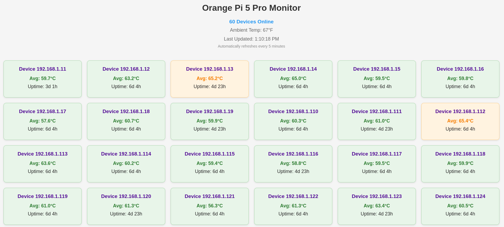

# Orange Pi Temperature Monitor

A web application to monitor Orange Pi 5 Pro mining devices on your local network.

## Screenshot

Screenshot shows the monitoring dashboard with multiple Orange Pi devices.

## Prerequisites

- Node.js 14 or higher
- SSH access to your Orange Pi devices
- Orange Pi devices on the network 192.168.1.0/24
- Orange Pi devices must have SSH enabled

## Installation

1. Clone this repository or download the files
2. Install dependencies:
```bash
npm install
```

## Configuration

1. Edit `server.js` to match your Orange Pi SSH credentials:
```javascript
await ssh.connect({
    host: host.ip,
    username: 'your-username',
    password: 'your-password'
});
```

2. If your network range is different from 192.168.1.0/24, modify the `network` variable in `server.js`:
```javascript
const network = 'your-network-range';
```

## Running the Application

1. Start the server:
```bash
npm start
```

2. Access the web interface at http://192.168.1.20:3000

## Features

- Automatically discovers Orange Pi devices on the network
- Displays real-time CPU temperature readings
- Displays uptime readings
- Updates every 5 minutes
- Visual warning for high temperatures (>70°C)

## Security Notes

- Change default SSH passwords on your Orange Pi devices
- Consider using SSH keys instead of passwords
- Ensure your network is properly secured
- This application is intended for local network use only

## Troubleshooting

If devices aren't showing up:
1. Verify SSH is running on the Orange Pi devices
2. Check SSH credentials
3. Ensure devices are on the specified network range
4. Check firewall settings on both server and devices
